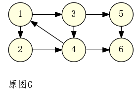
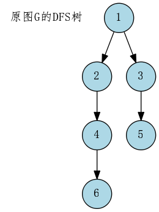
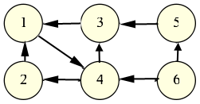
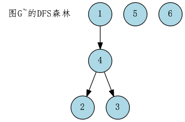

##
Kosaraju 算法可以用来计算强连通分量,并收缩强连通分量

操作步骤

 - 对原图G进行DFS,并将出栈顺序进行反序
 - 对原图G的每一条边时行反序,行到图G~
 - 按照反序,图G~进行DFS,遍历结果生成新的森林W2,W2每棵树上的顶点就构成了有向图的强连通分量

过程如下:

对原图G进行DFS

得到DFS树:

其中DFS遍历的先后顺序:**1,2,4,6,3,5**

出栈顺序:**6,4,2,5,3,1**

反序为:**1,3,5,2,4,6**

我们对原图G进行反序,得到G~:

按照**1,3,5,2,4,6**进行DFS,得到森林:

你会发现这些**1,2,3,4**这些点第一次被遍历完,它们是一个强连通分量,同样,5,6,各自是一个强连通分量
### 对Kosaraju算法的理解

1.每次DFS事实上是形成了一棵"DFS树",多次DFS形成"森林"

2.离root点越近的点一定是先进入栈中,后出栈

3.对于同一棵DFS树中的点无论**正序**还是**反序**都在在一起

4.对于同一棵树来说,正序中排在后面的点一定是最先访问的,也是反序中排在前面的点,这样的点就是树的root点,在图G~中 root点也能到的点 当然是一个**强连通分量**

#### 为什么不能用入栈顺序来访问?
    如果我们从**6**点开始访问,我们发现错了,把5点也算上了

